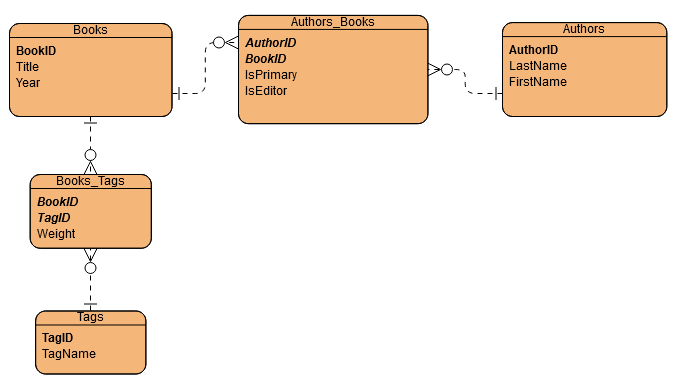

# Bookshelf
Yichen Zhang, July 2021
Version 1.0

## Overview
This keeps track of books I have read in better detail.

## Minimum Viable Product
* Java API server
    * Endpoints
    * Unit Tests: JUnit 4
* PostgreSQL database: bookshelf
* Vue front-end client

## Components

### Server

### Database

### UI

## Next Steps

## Additional Use Cases
* Login to differentiate between users
* Recommend books to other users based on tag scores matching
* Recommend books to other users based on lack of tag scores matching
* Incorporate feedback from other users
    * Other users can suggest tags for approval
    * Other users can submit book rating - weigh this in along with tag scores in recommendations (less weight with fewer ratings, closer to 50:50 with enough user ratings - threshold to be determined)
* See ratings from others by book
