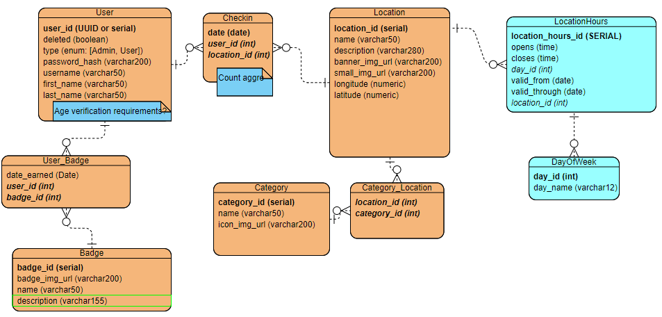

# Final Capstone

This directory contains our web application for exploring and navigating San Diego by foot.
Development Team: Yichen Z., Ellen M., Jeff M., Harry M.

## Who This is For
* The visitor: 
  * Enjoy a self-guided walking tour of San Diego 
  * No sinking a ton of time into research
  * Room for spontaneity
  * Keep track of trip locations for happy memories
* The local:
  * Discover new parts of their neighborhood and city by foot
  * No need to plan
* The virtual explorer:
  * Zoom around San Diego on a curated tour of the top attractions
  * Convenient maps and succinct details
* Users who value their privacy and experience:
  * Only you can see where you've been
  * We do not track your location
  * No fuss and no need to stay glued to your device - we get you there, and then you are free to enjoy the best that San Diego has to offer

## Overview

### Getting Started

* Make sure to run Schema.sql before looking at the most current version of the code

### General Conventions

* locationId - Java and JavaScript use camelCase names
* bannerImgURL - URL is all capital so be careful with that

### Database

PostgreSQL



References:
* Longitude and latitude lookup: 
  * https://www.latlong.net
  * Wikipedia
  * Google Maps

### Backend Server

Java

Endpoints: 
* "/api": base URL
* "/locations": list all locations from database
* "/locations/{locationID}": returns detailed information about one specific location
* "/categories": returns all location categories
* "/users": list all users (admin access only)
* "/users/{userID}": returns detailed information about one specific user (that user access only)
* "/users/{uerId}/location/{locationId}": allows posting of new data to the checkin table
* "users/{userId}/badge": retrieves all badges, including information on whether a user has earned them yet

### Frontend Application

Vue

Consumed APIs:
* Backend server for in-house data
* Mapbox for map functionalities

Pages:
On every page (except login, register, and profile):
  * SearchBar
    * CategoryIcon
  
* Home
  * SearchBar
  * HomePage
    * ClosestMap - plot the user's location and 3 attractions closest to it
    * LocationsList - 1) Randomly generated exploration suggestions; 2) List of all locations
      * LocationCard
        * CategoryIcon - return a row of categories the location belongs to
* SearchBar - enables search by name
  * SelectableCategoryIconList - allows user to filter locations by their category; toggles between all lists and filter
    * CategoryIcon - return a row of all categories
* Results
  * SearchBar
  * LocationsList - returns list of all locations that match the search query by name
  * LocationMap - plots each result
* LocationDetails
  * LocationHours - returns info on hours
  * CategoryIconList - fills in all category icons
  * SingleDestination - provides map with directions
* Profile
  * UserDetails
    * BadgeShelf
      * BadgeIcon - achieved badges are in full color; badges yet to be achieved are grayed out
    * CheckinContainer
      * CheckinCard - includes date of check-in
        * LocationCard - includes basic details of the location, cannot be clicked

### Image sources

* Category icons

    Attribution: 
  ```html 
  <div>Icons made by <a href="http://www.freepik.com/" title="Freepik">Freepik</a> from <a href="https://www.flaticon.com/" title="Flaticon">www.flaticon.com</a></div>
  ```
  * Beach: https://image.flaticon.com/icons/svg/2918/2918660.svg
  * Park: https://image.flaticon.com/icons/svg/941/941543.svg
  * Museum: https://image.flaticon.com/icons/svg/3068/3068691.svg
  * Restaurant: https://image.flaticon.com/icons/svg/685/685352.svg
  * Sports Stadium: https://image.flaticon.com/icons/svg/821/821357.svg